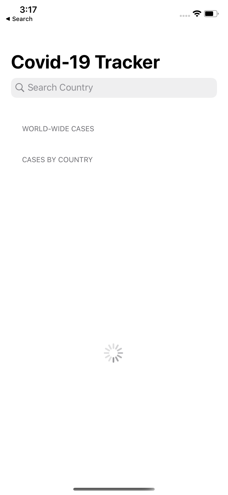
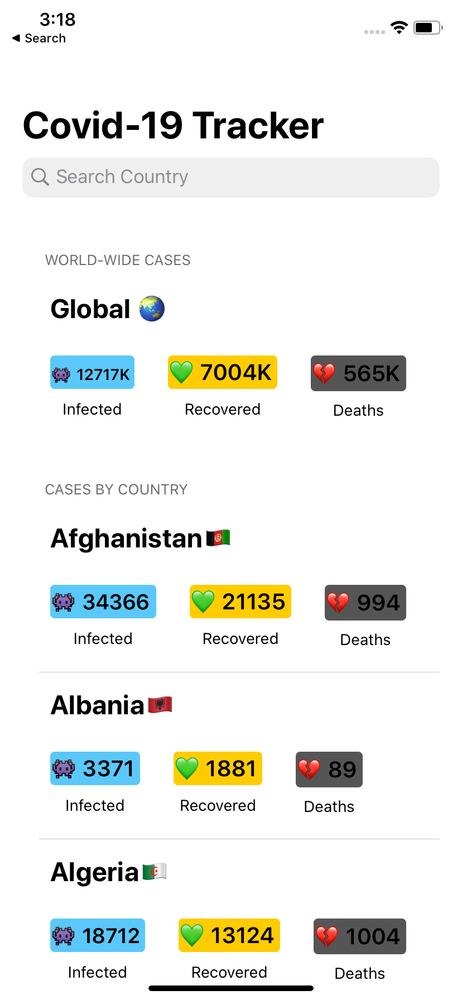
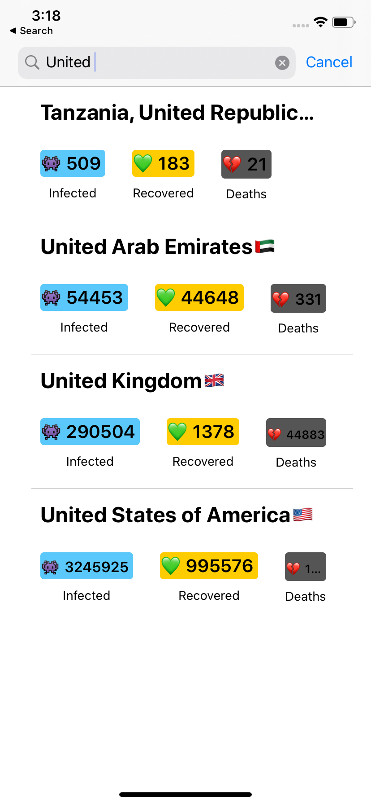

# Covid-19-Tracker
An iOS app which shows Covid-19 cases per country and also has pull to refresh and search option. UI design was taken from [Swapnil Dhol's app](https://github.com/SwapnanilDhol/CornonaTracker) and I had to redo all the backend because the API
used in Swapnil Project is not upto date.

Loading Screen | Home Screen                |  Search Screen
:-------------------------:|:-------------------------:|:-------------------------:
| |  

<h2>API</h2>
https://api.covid19api.com/summary

[API documentation](https://documenter.getpostman.com/view/10808728/SzS8rjbc?version=latest#27454960-ea1c-4b91-a0b6-0468bb4e6712)

